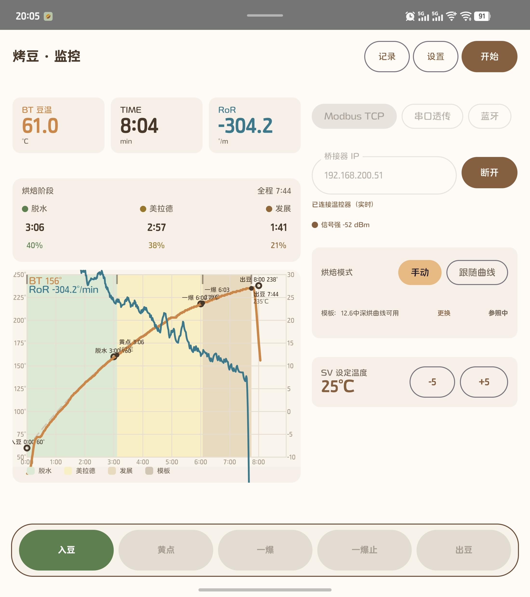

# RoastCurve (烤豆)

[](LICENSE) [](NOTICE.txt)
[](#)
[](#)
[](#)

Mobile coffee roasting monitor & curve designer for DIY hot-air roasters. Compatible with the Artisan ecosystem.

> Chinese documentation: [README.md (中文)](README.md)

Sister app: [BeanBag (CoffeeBeanTracker)](https://github.com/MDx-MoJe/CoffeeBeanTracker) · [Gitee](https://gitee.com/MDx-MoJe/coffee-bean-tracker) — green/roasted bean inventory, brew tracking. The two apps sync roast deductions via a system-level interface.

```
BeanBag  (豆袋) → manage beans (inventory, records, cupping)
RoastCurve (烤豆) → manage curves (monitoring, design, export)
```

## Features

- **Live monitoring**: Modbus TCP via WiFi-RS485 gateway or a DIY ESP32 bridge; real-time bean temperature, RoR, event markers (Charge / Yellowing / First crack / Drop), phase statistics
- **Profile follow (auto-roasting)**: follows a target curve and drives SV automatically, with lookahead compensation and deviation fuse
- **Profile designer**: extract from history, import Artisan `.alog`, or draw custom anchor curves (FC monotone cubic interpolation)
- **Recording**: 30s auto-draft + drop snapshot + finalize on stop; crash-safe session restore; CSV/JSON export
- **BeanBag sync**: after each roast, automatically deduct green beans & add roasted stock (idempotent)
- **Language packs**: built-in Chinese & English; import community language packs (zip) at runtime

100% offline. No ads, no tracking, no accounts.

## Screenshots

Live monitor dashboard: dual-pane layout with real-time bean temperature / time / RoR cards, phase statistics, manual or curve-follow auto roasting, and one-tap event markers (Charge / Yellowing / First crack / Drop).



## Tech Stack

| Layer | Choice |
|---|---|
| Framework | Kotlin Multiplatform + Compose Multiplatform |
| Charts | Hand-written Compose Canvas (dual Y-axis / phase coloring / live scroll) |
| Device protocol | Modbus TCP (WiFi-RS485 gateway / DIY ESP32 firmware), TCP & BLE passthrough |
| Networking | Ktor Client (OkHttp / Darwin) |
| Serialization | kotlinx.serialization |

## Downloads

Grab the APK and ESP32 firmware `.bin` from the [Releases](releases/) page (GitHub · Gitee: gitee.com/MDx-MoJe/roast-curve/releases).

## Build

```bash
# Android Debug APK
./gradlew :androidApp:assembleDebug

# iOS compile check (simulator arch)
./gradlew :composeApp:compileKotlinIosSimulatorArm64
```

Requirements: JDK 17+, Android SDK 34, Xcode 15+ (iOS).

> Debug builds work without any signing setup. For release builds, copy
> `keystore.properties.example` to `keystore.properties` with your own keystore.

## DIY ESP32 Bridge Firmware (esp32-firmware/)

A drop-in replacement for commercial WiFi-RS485 gateways — the app works unchanged, just point it at the bridge's IP:

- Full Modbus TCP↔RTU gateway (not raw passthrough); standard exception frames on timeout/CRC errors
- BLE provisioning (Nordic UART Service), WiFi credentials stored in NVS
- OTA firmware updates over WiFi
- HTTP status endpoint `:8898` (RSSI / uptime / client count)
- WS2812 status LED: green=ready, cyan=client connected, red=reconnecting, purple blink=setup mode

## Protocol (Modbus TCP — verified on hardware)

Link: `Controller --RS485--> Bridge (TCP:8899) --> App`

| Parameter | Value |
|---|---|
| Slave ID | 1 |
| Function codes | FC03 read / FC06 write |
| PV (bean temp) | register `0x0000`, uint16 big-endian, °C |
| SV (setpoint) | register `0x0002` (writable) |
| PID | 0x0009=P, 0x000A=I, 0x000B=D |

Probe tool: `tools/probe_tc4s.py <IP>`

## License & Trademark

**Code**: licensed under [Apache License 2.0](LICENSE) — free to use, study, modify and redistribute.

**Not covered by the license**: the app name "烤豆 / RoastCurve", the logo, and the official signing certificate remain the property of MDx. Forks must rename the app and replace the logo. See [NOTICE.txt](NOTICE.txt).

**Self-builds**: fully functional, marked "Community build" in-app. No restrictions.

## Support

RoastCurve is free, open-source and ad-free forever. If it helps your roasting, consider a star on [GitHub](https://github.com/MDx-MoJe/RoastCurve/stargazers) or [Gitee](https://gitee.com/MDx-MoJe/roast-curve), or [sponsoring on Afdian](https://afdian.com/a/RoastCurve). See [SPONSOR.md](SPONSOR.md).

Copyright © 2026 MDx
