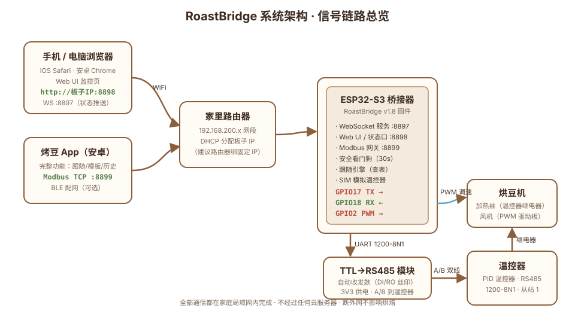
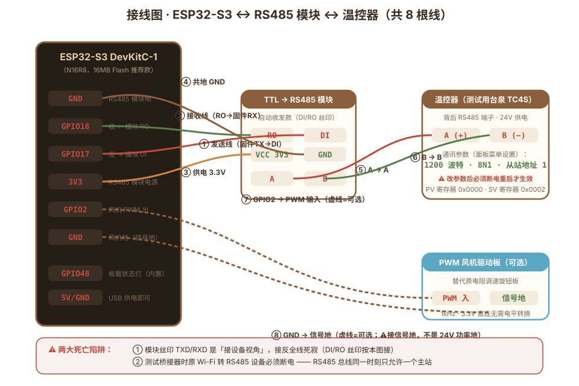
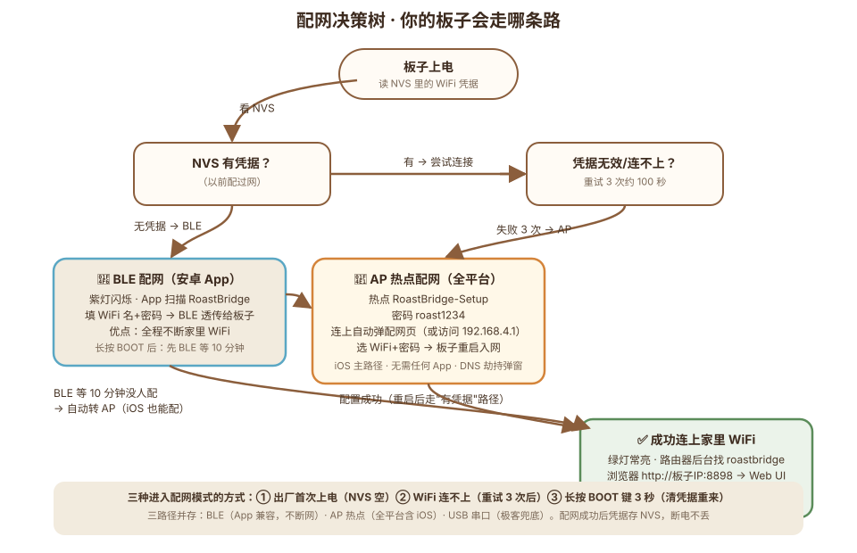
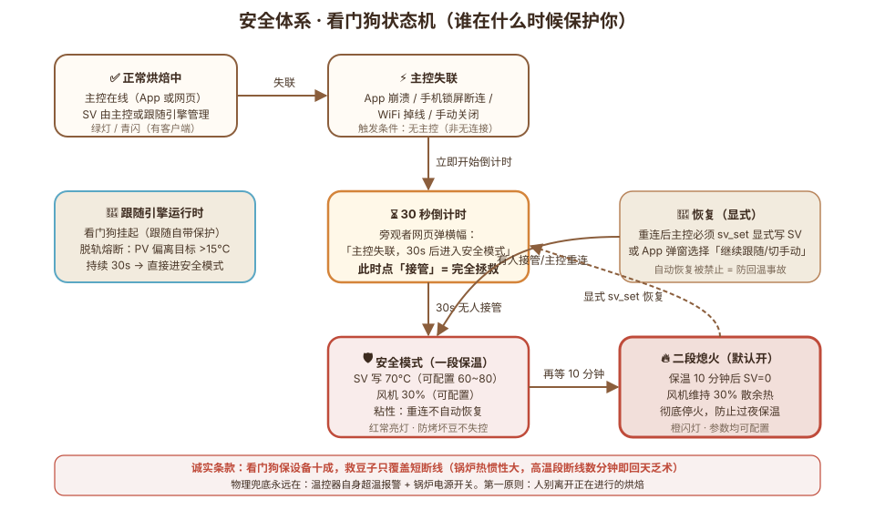

# 烤豆 RoastCurve · 完整用户指导手册

> **这份手册写给谁**：拿到（或打算 DIY）烤豆系统的你。从"这是什么原理"到"为什么连不上"，每一项都讲清楚：**怎么做 → 为什么是这样设计 → 出了问题怎么排查**。
>
> **阅读路线**：只想快速跑起来 → 看《快速上手.md》；想知道每个设计背后的原因、出问题自己动手排查 → 读这份。
>
> 文档版本对应固件 v1.8.3 / App v1.3.20（2026-09）

---

## 目录

1. [系统是什么：整体架构](#一系统是什么整体架构)
2. [工作原理：为什么这样设计](#二工作原理为什么这样设计)
3. [硬件清单与选购指南](#三硬件清单与选购指南)
4. [接线详解（带图）](#四接线详解)
5. [固件刷写](#五固件刷写)
6. [配网：让板子连上你家 WiFi](#六配网)
7. [Web 网页端使用（iOS/电脑）](#七web-网页端使用)
8. [安卓 App 使用详解](#八安卓-app-使用详解)
9. [跟随曲线：自动烘焙](#九跟随曲线自动烘焙)
10. [安全体系详解](#十安全体系详解)
11. [故障排查手册](#十一故障排查手册)
12. [进阶玩法与开放协议](#十二进阶玩法与开放协议)

---

## 一、系统是什么：整体架构

### 1.1 一句话说明白

**用手机替代烘焙机上的旋钮和温度计**：温控器（测试用台泉 TC4S）通过 RS485 总线报告豆温、接受火力指令；ESP32 小板把 RS485"翻译"成 WiFi 信号；手机上的 App 或网页连上这块小板，就能看曲线、设温度、跑自动跟随曲线。



### 1.2 每个部件干什么

| 部件                   | 角色        | 为什么需要它                                                                             |
| -------------------- | --------- | ---------------------------------------------------------------------------------- |
| ** 温控器（测试用台泉 TC4S）** | 系统的"手和眼"  | 工业级 PID 控制器：读取热电偶温度（PV），按设定值（SV）控制加热输出。烘焙的温度闭环靠它的硬件 PID，**不依赖手机**——这就是为什么手机断网也不会失控 |
| **ESP32-S3 桥接器**     | 翻译官 + 服务器 | 温控器只说 RS485 方言（Modbus RTU），手机只懂 WiFi。桥接器做双向翻译，顺便升级成一个带网页、带安全看门狗的小服务器               |
| **TTL→RS485 模块**     | 电平转换      | ESP32 引脚输出 3.3V 逻辑信号，RS485 总线是差分信号，这个几块钱的小模块做电压制式转换                                |
| **PWM 风机驱动板**（可选）    | 风机调速      | 把原来的电阻调速旋钮换成可编程 PWM 控制，实现"温度+风速"双变量烘焙                                              |
| **手机 App / 网页**      | 人机界面      | 看曲线、打事件标记、管理模板、跑跟随。App 功能全；网页端 iOS 也能用                                             |

### 1.3 关键设计理念（读懂这个，后面全通）

1. **闭环在本地，网络只做界面**。温度控制的核心循环（PID 计算、火力输出）在温控器硬件里，不在手机里。手机只是一个"遥控器+仪表盘"。所以：WiFi 断了，温控器继续按最后设定工作；手机崩了，物理层依然安全。

2. **一切都在局域网**。整套系统不经过任何云服务器、不需要注册账号、不依赖外网。断外网照常烘焙。你的烘焙数据不出家门。

3. **看门狗在固件里，不在 App 里**。App 可能崩溃、锁屏、被系统杀，所以安全兜底逻辑放在板子固件里（详见第十章）。App 死了看门狗还活着。

4. **单主站原则**。RS485 总线同一时刻只允许一个主站说话。桥接器是主站，原厂 WiFi 转 RS485 设备也是主站——两者只能活一个（接桥接器时原设备必须断电）。

---

## 二、工作原理：为什么这样设计

### 2.1 Modbus 协议：工业界的普通话

温控器世界没有蓝牙没有 WiFi，Modbus RTU 是最通用的语言。每次通信是一问一答：

```
主站问：  「1 号站，把 0x0000 寄存器的值给我」（读 PV 豆温）
从站答：  「值是 165」（单位 1°C）
主站问：  「1 号站，把 0x0002 寄存器设为 180」（写 SV 设定）
从站答：  「好的」
```

- **寄存器就是温控器的内存地址**。以测试用台泉 TC4S 为例，关键地址：`0x0000`=PV 豆温（只读），`0x0002`=SV 设定（可写），`0x0009/A/B`=PID 参数
- **CRC 校验**：每帧末尾带 2 字节校验码，传输出错整帧丢弃重试——工业现场的抗干扰设计
- **波特率默认 1200（可配）**：固件与温控器通讯参数（波特率/寄存器地址/从站）可配，兼容不同品牌。默认 1200 是自动收发模块最稳档位，9600 在正确接线下也读写全通

### 2.2 桥接器做了什么翻译

手机发出的是 Modbus **TCP** 帧（网线/WiFi 上的版本，带 MBAP 头），温控器只听 Modbus **RTU**（串口版本，带 CRC 校验）。桥接器做的事：

```
手机 → [MBAP 头 + 读 PV 请求] → 桥接器拆头、加 CRC → [RTU 帧] → RS485 总线 → 温控器
温控器 → [RTU 应答+CRC] → 桥接器验 CRC、剥掉、加 MBAP → [TCP 帧] → 手机
```

听起来只是搬运工？v1.5 之后桥接器升级成了**服务端**（见 2.3），这是理解本系统架构的关键。

### 2.3 从网关到服务端：v1.5 的架构升级

v1.3 时代桥接器是纯翻译官：安卓 App 说啥传啥。v1.5 起桥接器有了自己的大脑：

| 能力 | 为什么这样设计 |
|---|---|
| **统一轮询** | 固件每秒读一次 PV/SV 存入缓存。所有客户端（App/网页）读状态都走缓存而不是各自上总线——RS485 是单主站总线，两个客户端同时发请求会撞车。轮询缓存=总线永远只有固件一个说话者 |
| **WebSocket 推送** | 网页连上后被动收状态流（1 次/秒），不用自己发请求。省流量、低延迟、代码简单 |
| **会话仲裁** | 多个客户端同时连（App+iPhone+电脑）时，谁有权控制？协议即身份：走 8899 Modbus 的=App 主控，走 8897 WebSocket 的=旁观者（可一键接管）。单主控锁保证任何时刻只有一个指挥官 |
| **安全看门狗** | 主控失联 30 秒自动进入安全模式（详见第十章）。放在固件里因为 App 会死，固件不会 |
| **跟随引擎** | 曲线跟随的查表执行放在固件里：手机锁屏/App 崩溃都不中断烘焙（详见第九章） |

**设计哲学一句话**：把"必须活着的东西"放在最靠近机器的地方（固件），把"体验好的东西"放在最方便的地方（手机）。反过来做（把安全逻辑放 App 里）就是拿电热设备赌运气。

### 2.4 温度曲线跟随的原理

跟随模式 = 把一条满意的 historic 曲线变成 setpoint 序列自动回放：

1. 模板本质是**锚点列表**：`(时间, 温度)` 对，如 `(0s, 25°), (180s, 120°), (420s, 165°)...`
2. 启动跟随前，客户端把锚点**预采样成 5 秒间隔的目标数组**上传给固件（插值算法在 App 内做单调三次插值，平滑无过冲）
3. 固件每 5 秒查表：现在该是多少度 → 写 SV → 温控器 PID 自己追
4. 写 SV 有最小步长过滤（与上次差 ≥1° 才写），减少总线流量
5. **为什么 5 秒一拍**：温控器的 PID 响应速度 + 锅炉热惯性决定了更快的指令没有意义；5 秒是"指令变化频率"与"总线占用"的平衡点

跟随时为什么 SV 显示会"自己动"？因为跟随引擎每 5 秒在覆盖 SV。曲线走完会自动回落到 25°C（可调）。想中途停：点「停止跟随」或急停。

### 2.5 为什么 iOS 是网页、安卓是 App

| | 安卓 App | iOS 网页 |
|---|---|---|
| 分发 | APK 直装/应用市场 | 无需安装，浏览器输 IP |
| 成本 | 免费 | **零成本** |
| 连接设备 | 直连 Modbus TCP | WebSocket |
| 后台保活 | 前台服务，锁屏不断 | Safari 锁屏断连 |
| 数据持久化 | SQLite 本地库 | 固件内采样，刷新不丢 |
| 功能范围 | 全部 | 监控、控制、跟随、记录 |

iOS 网页版是"够用"哲学：零成本 + 零安装。

---

## 三、硬件清单与选购指南

### 3.1 必购清单

| 硬件 | 规格要求 | 参考价 | 选购原因 |
|---|---|---|---|
| ESP32-S3 开发板 | **N16R8**（16MB Flash + 8MB PSRAM） | ¥25~35 | 16M 跑全部功能+未来扩展；8M（N8R8）也能跑当前全功能；**4M 板只能用旧版 v1.3**。注意型号后缀：N=Flash 大小，R=PSRAM 大小，外观一模一样，买错没法补救 |
| TTL→RS485 模块 | **自动收发款，丝印 DI/RO** | ¥3~6 | 见 3.2 选型详解，这是新手翻车重灾区 |
| 温控器（测试用台泉 TC4S） | RS485 通讯版（带 485 端子） | ¥150~200 | 工业标准 Modbus 协议、硬件 PID、继电器输出。其他品牌 Modbus 温控器理论兼容（改寄存器地址即可） |
| 热电偶 | K 型，配温控器 | ¥10~20 | 探针式，插豆堆测 BT 豆温 |
| 24V 电源 | 按烘豆机加热功率选 | — | 温控器和风机驱动板供电 |
| 杜邦线 | 母对母 ×8 | ¥2 | 接线用 |

### 3.2 RS485 模块怎么选（避坑重点）

**买**：丝印是 **DI / RO**（或 TXD/RXD 但明确标注"自动收发"）的模块，芯片常见 MAX485/SN75176：

- **DI**（Driver Input）= 数据输入，接固件 TX
- **RO**（Receiver Output）= 数据输出，接固件 RX
- 自动收发 = 模块自己判断何时发送何时接收，固件不用管方向切换

**别买**：
- 丝印只有 TXD/RXD 且查不到芯片型号的——TXD 在不同厂家含义相反（有的是"接设备的TX"有的是"我就是TX"），接反全线死寂。这是新手第一大坑
- 带方向脚（DIR/RE）但你要手动控方向的——能用但费事，固件要加方向控制代码

**已验证结论**：自动收发模块在 1200 波特率下读写全通。（早期"必须 1200 降速"的结论后来证实是接线视角错误导致的误判，但 1200 对自动收发模块依然是最稳档位。）

### 3.3 为什么推荐 16MB 的 ESP32-S3

| | 4MB 板 | 8MB 板（N8R8） | 16MB 板（N16R8，推荐） |
|---|---|---|---|
| 可用固件 | v1.3.x 旧版（配安卓 App） | **当前全功能（v1.8.3）** | 当前全功能 + 未来扩展 |
| 固件空间余量 | v1.4+ 装不下 | 3.3MB 上限，现用 37% | 6.4MB 上限，现用 7% |
| 文件系统 | 1.5MB | 1.5MB | 3.4MB（预留给 Web UI 资源/多语言） |
| 价差 | — | +¥3 | +¥6 |

16M 板贵 6 块钱买 5 倍固件空间和 3 倍文件系统，划算到不用犹豫。**PSRAM 大小（R 后缀）对当前固件无影响**，N16R8 和 N16R8V 都行。

### 3.4 烘豆机侧的要求

本系统假设你的烘豆机是 **DIY 热风/半热风机型**：
- 加热由温控器继电器控制（温控器输出端子接接触器/SSR）
- 风机原为旋钮调速（要自动化才需要换 PWM 驱动板 + 接风机 GPIO，默认 GPIO2 可配）
- 测试用台泉 TC4S 通过 RS485 端子对外通讯（部分廉价款只有继电器输出没有 485，买前确认）

---

## 四、接线详解



### 4.1 RS485 通信线（4 根，必须）

| # | 从（ESP32） | 到（RS485 模块） | 线的作用 |
|---|---|---|---|
| ① | GPIO17 (TX) | **DI** | 固件发送的数据从这个脚进模块 |
| ② | GPIO18 (RX) | **RO** | 模块收到的数据从这个脚出，进固件 |
| ③ | 3V3 | VCC | 模块供电（3.3V，别接 5V） |
| ④ | GND | GND | 共地（电压参考基准） |

然后模块的 **A/B 端子** 接温控器背面的 RS485 端子：**A 对 A、B 对 B**。

### 4.2 风机 PWM 线（2 根，可选）

| # | 从（ESP32） | 到（PWM 驱动板） | 说明 |
|---|---|---|---|
| ⑦ | GPIO2（默认，可配） | PWM 调速输入 | 3.3V 直连，无需电平转换（实测） |
| ⑧ | GND | 信号地 | ⚠ 接驱动板的**信号地**，不是 24V 功率地 |

前提：原烘豆机是电阻调速旋钮，需要换 PWM 款无刷驱动板（24V）。不接这两根线，RS485 温控功能完全不受影响。

### 4.3 接线的三条铁律（血泪总结）

1. **DI/RO 视角铁律**：模块丝印 DI 是"数据进入模块"，RO 是"数据从模块出来"。按本图接（17→DI、18←RO）。如果你的模块丝印是 TXD/RXD，先搞清视角再接——接反的现象是"全线死寂"（字节永远上不了总线，窃听器 0 字节），这是新手第一大坑。

2. **单主站铁律**：调试/使用桥接器时，只能允许接入一个主站设备（桥接器或 Wi-Fi 转 485 等）。

3. **温控器改参数必断电重启**：在温控器面板菜单里改波特率/校验位后，不重启不生效。

### 4.4 状态灯语义（WS2812 彩灯）

| 灯色 | 含义 | 你该做什么 |
|---|---|---|
| 绿常亮 | WiFi 已连，待机 | 正常，可以连了 |
| 青色闪烁 | 有客户端已连上 | 正常，App/网页在工作 |
| 红色闪烁 | WiFi 断开重连中 | 检查路由器；重试 3 次失败会转 AP 配网 |
| 紫色闪烁 | 配网模式（BLE） | 用 App 配网 |
| 品红闪烁 | AP 热点配网中 | 手机连 RoastBridge-Setup 热点 |
| 黄色闪烁 | 看门狗倒计时 | 主控失联！接管或 30 秒后进安全模式 |
| 红色常亮 | ⚠ 安全模式生效 | SV 已压至 70°C，检查锅炉后显式恢复 |
| 橙色闪烁 | 二段熄火已执行 | 安全模式保温 10 分钟后自动停火 |

---

## 五、固件刷写

### 5.1 三种刷写方式（按容易程度排序）

**方式 A：网页刷写（推荐，零安装，Chrome/Edge 浏览器）**

1. 浏览器打开 Espressif 官方工具：`https://espressif.github.io/esptool-js/`
2. 板子 USB 插电脑，网页里选串口（COM 口），芯片 ESP32-S3，波特率 115200
3. 偏移填 **`0x0`**，文件选下载的 `roastbridge-*.merged.bin`
4. 点 Program。没反应？**按住板上 BOOT 键**再点，开始传输后松手
5. 完成按 RST 键重启

> 为什么用 merged.bin：单文件包含 bootloader+分区表+应用三个部分，刷 0x0 一次搞定，不需要理解偏移量。

**方式 B：esptool 命令行**

```bash
pip install esptool
esptool.py --chip esp32s3 --port COM3 write_flash 0x0 roastbridge-*.merged.bin
# macOS 端口形如 /dev/cu.usbmodemXXXX
```

**方式 C：Arduino IDE 从源码编译**（改代码才需要）

详见 `esp32-firmware/README.md`。核心要点：
- 开发板选 ESP32S3 Dev Module
- **Flash Size: 16MB**（8M 板选 8MB 并移走 partitions.csv，见 PARTITIONS.md）
- PartitionScheme: **Custom**（16M 板直接用仓库里的 partitions.csv）
- USB CDC On Boot: Enabled
- 依赖库：WebSockets、ArduinoJson（库管理器安装）

### 5.2 刷写失败的排查

| 现象 | 原因 | 解法 |
|---|---|---|
| 网页刷写找不到串口 | 没装驱动/用了 USB Hub | 换原装短线直插；S3 板双 Type-C 口试另一个 |
| Connected 失败 | 芯片没进下载模式 | **按住 BOOT 键**点 Program，出现连接后松开 |
| 写入进度到 N% 失败 | 可能闪存坏块 | 换 USB 口/线重试；仍失败按第十一章验闪存 |
| A fatal error occurred | 端口被占用 | 关掉 Arduino 串口监视器等其他占用程序 |

---

## 六、配网



固件**不内置**任何 WiFi 密码（你的密码只存在板子自己的 NVS 里，断电不丢，不进任何云端）。首次上电自动进入配网模式。三条路径按你的设备情况选：

### 6.1 路径一：AP 热点配网（全平台，iOS 用户唯一选择）

**原理**：板子自己变成一个 WiFi 热点 + 网页服务器。你的手机连上这个热点，就像连酒店 WiFi 一样自动弹出配置页面。

1. 板子进入配网模式（品红/紫灯闪烁）
2. 手机「设置 → WLAN」找到热点 **RoastBridge-Setup**，密码 **roast1234**
3. iOS 会自动弹出配网页（安卓可能需要手动打开浏览器访问 `http://192.168.4.1`）
4. 点「扫描附近 WiFi」→ 选你家的 → 输密码 → 连接并保存
5. 板子保存凭据并重启，连上你家网络。**手机 WiFi 切回家**

**为什么连热点时手机会断网**：手机连上了板子的热点，自然就离开了家里 WiFi（一个手机同一时间只连一个 WiFi）。这是物理限制，配完就恢复。

### 6.2 路径二：BLE 蓝牙配网（安卓 App，体验最顺）

**原理**：App 通过低功耗蓝牙（BLE）把 WiFi 凭据"递"给板子。

1. 板子紫色闪烁（BLE 配网模式）
2. 烤豆 App → 设置 → 蓝牙配网 → 扫描选择 RoastBridge
3. 填家里 WiFi 名+密码 → 发送
4. 板子保存并重启入网

### 6.3 路径三：USB 串口（极客兜底）

板子插电脑，串口监视器 115200，第一行输 WiFi 名回车、第二行输密码回车。

### 6.4 配网相关细节

- **什么时候会自动进入配网模式**：① NVS 里没有凭据（出厂首次）② WiFi 连接重试 3 次失败（约 100 秒）③ 长按 BOOT 键 3 秒（清空凭据重来）
- **换 WiFi 怎么办**：长按 BOOT 3 秒清凭据 → 自动进配网
- **配网成功后板子 IP 是什么**：路由器 DHCP 分配。到路由器后台找名为 `roastbridge` 的设备（mDNS 也能发现 `roastbridge.local`）。**强烈建议在路由器里给它绑固定 IP**，否则 DHCP 可能换地址导致 App 连不上
- **BLE 10 分钟窗口**：长按 BOOT 清凭据后，板子先开 BLE 等 10 分钟（给 App 用户），超时自动转 AP 热点（给 iOS 用户）——两条路都不会卡死

---

*（第七章至第十二章见下一段）*

## 七、Web 网页端使用

**给谁用**：iOS 用户（没有 App 可装）、电脑用户（想在大屏看曲线）、以及想在不装任何东西的情况下试用的人。

### 7.1 打开方式

浏览器（iOS Safari / 安卓 Chrome / 电脑 Chrome）访问：

```
http://<板子IP>:8898
```

板子 IP 在路由器后台找（设备名 roastbridge），或在 App 连接设置里看。建议加到主屏幕（iOS Safari 分享 → 添加到主屏幕），图标化使用。

### 7.2 界面分区

Web UI 是单页应用，底部两个主视图：**监控**（实时控制）与**记录**（历史）。

监控页各区域：

| 区域 | 内容 | 说明 |
|---|---|---|
| 顶部徽标 | 连接状态 | 绿=已连接，红=断开，黄闪=看门狗倒计时中；旁有信号强度分级（强/中/弱/极弱） |
| PV / SV 卡 | 当前豆温 / 设定温度 | 1 秒刷新，颜色与曲线对应 |
| 曲线图 | PV/SV/跟随目标 三条线 | 10 分钟滚动窗口；跟随中带事件标记点（入豆/黄点/一爆…带时间温度） |
| RoR 卡 | 升温速率 °C/分 | 60 秒窗口差分计算 |
| 主控卡 | 当前谁在控制 | 「本网页」「安卓 App」「无」；未接管时显示接管按钮 |
| 跟随曲线卡 | 模板选择 + 启停 | 选模板、启动/停止跟随、导入 .alog、🖌 手绘曲线、管理模板（见第九章） |
| SV 滑块 | 手动设定温度 | 主控可用；带草稿值提示 |
| 风机滑块 | 风速 0-100% | 拖动即实时下发 + 回传确认 |
| 事件条 | 入豆/黄点/一爆/二爆/出豆 | 记录带时间+温度 |
| 急停按钮 | 红色大按钮 | 任何角色可用，二次确认 |

记录页：本炉记录列表，点开看详情，可导出 zip（单条/全部），可「存为模板」。

设置（右上角 ⚙）：显示风机开关、**GPIO 引脚配置**（TX/RX/风机三脚下拉，见 8.6）。

### 7.3 SV 滑块的「草稿」逻辑

滑块旁的大数字块就是当前滑块值，小字标注状态：

- 拖动滑块 → 数字变化，显示「**°C 待下发**」（橙色描边），此时还没发给固件
- 点「下发」→ 确认弹窗 → 发送，小字变「°C」（与固件一致）
- **拖动后 3 秒内不点下发 → 自动放弃草稿**，滑块跳回固件当前值

为什么要草稿机制：页面每秒收一次固件状态推送，如果推送直接覆盖滑块，你永远拖不动它。草稿期给你 3 秒从容决定，超时回滚防止误留危险设定值。

### 7.4 接管与主控权

多个客户端同时连接时（比如 App 在主控、iPhone 开着围观），遵循**单主控锁**：

- 走 Modbus TCP 的 App 连上即主控；网页默认是旁观者（只读+急停权）
- 网页点「接管控制」→ 立刻成为主控，App 那边下次写 SV 会被拒
- 主控权变更全端广播，界面实时更新

为什么这样设计：烘豆最怕两个客户端打架（一个升温一个降温）。单主控+显式接管=任何时刻指挥权唯一。

### 7.5 iOS 用户的诚实须知

- **锁屏断连**：iOS 系统会掐掉后台网页的 WebSocket。烘焙监控时请保持屏幕常亮（设置→显示与亮度→自动锁定→永不）。页面做了断流检测+亮屏自动重连
- **记录不丢（v1.8+）**：跟随期间固件每 5 秒自主采样存内存（最长 120 分钟），网页刷新/锁屏/换设备都不丢曲线——重新打开自动恢复计时、事件与历史。出豆后可在「记录」页导出 zip 留档（固件内存断电会清）
- **跟随不中断**：锁屏只断你的"观看"，跟随引擎在固件里继续跑，跑完自动回落 25°C，重连后画面自动跟上

---

## 八、安卓 App 使用详解

### 8.1 连接与状态

- **连接**：设置页填桥接器 IP（建议路由器绑固定后一劳永逸），或开「启动时自动连接」
- **信号强度**：连接成功后顶部显示 dBm——绿（>-60 强）黄（-60~-75 中）橙（-75~-85 弱）红（<-85 极弱）。橙/红请挪板子位置，烘焙中途掉线都是信号埋的雷
- **开始/停止**：「已连接·待命」时按开始才记录；「入豆」也会隐式起表。「停止」=断开+曲线定稿保存

### 8.2 烘焙全流程（浓缩版）

```
通电 → 连接 → 开始（或直接入豆）→ 投豆瞬间点「入豆」（计时起点）
→ 过程中点事件（黄点/一爆/一爆止/[二爆/二爆止]/出豆）
→ 点「出豆」（SV 自动写 25°C 进冷却 + 立即存快照）
→ 冷却完成 → 停止（定稿）→ 记录里补录生熟豆重 → 自动算失重率
```

**为什么投豆瞬间要点入豆**：入豆是整个数据系的锚点——计时归零、预热段数据清空、跟随曲线的时钟从这一刻对齐。晚点 10 秒，所有阶段统计全错位。

### 8.3 模板系统

三种来源：**历史提取**（满意的一炉→存为模板）、**Artisan 导入**（.alog 文件自动解析，事件锚点自动带）、**自定义锚点**（画布手势：点空白加锚点、长按拖动、列表精修）。

锚点是什么：曲线的关键拐点（脱水结束、一爆开始……）。固件不需要完整曲线，App 内部把锚点插值（单调三次插值，防过冲）采样成 5 秒序列再发给固件。

### 8.4 数据保存的三层保险

| 时机 | 行为 |
|---|---|
| 记录中每 30 秒 | 自动存草稿 |
| 点出豆 | 立即存快照 |
| 停止/断开 | 最终定稿 |

同炉覆盖更新永不重复建档。**App 崩溃最多丢 30 秒数据**。前台服务保活让锁屏/切后台不杀进程（建议同时开 i 管家后台白名单双保险）。

### 8.5 与豆袋 App 互联

烘完一炉自动推送给姊妹应用 CoffeeBeanTracker（豆袋）：扣生豆库存+熟豆入库（幂等，重复推送不重复计）。历史记录里也可手动「补录到豆袋」。

### 8.6 桥接器 GPIO 引脚配置（换板不换线）

App 设置 →「桥接器 GPIO 引脚」可配 RS485 TX/RX 与风机 PWM 三脚（Web UI 设置 → GPIO 引脚配置 同源）：

- 适合 DIY 玩家换 ESP32 板子但不想改线/改代码的场景
- 下拉选脚，三脚互斥（已分配的脚在其他下拉里置灰）
- 保存后重启桥接器生效
- 可用池已排除硬件占用脚（flash 26-32 / PSRAM 33-37 / USB 19-20 / 争议脚 1,3,45,46）
- 固件 ≤v1.4 无版本号、≤v1.7 不支持此功能——App 会提示升级到 v1.8.1+
- 改错连不上？长按 BOOT 键 3 秒恢复默认（TX=17 / RX=18 / 风机=2）

### 8.7 App 设置项一览

| 设置 | 默认 | 说明 |
|---|---|---|
| 入豆自动开始跟随 | 关 | 入豆瞬间若已选模板，自动进入跟随 |
| 启动时自动连接 | 关 | 打开 App 自动连上次的桥接器 IP |
| 深烘模式（显示二爆） | 关 | 事件条增加 二爆/二爆止 两键，意式深烘用 |
| 跟随前瞻 lookahead | 0 | SV 提前参考 N 秒后的目标，补偿炉子热惯性（按机型实测调） |
| 跟随结束回落 | 25°C / 25% | 曲线走完自动降到的温度与风速（20~120°C / 0~100%） |
| 自动风速下限 | 30% | 自动风速模式不低于此值，保证豆子翻滚（7~60%） |
| 温控器参数 | TC4S 默认 | PV/SV 寄存器、波特率、从站地址（兼容其他品牌，见 12.4） |
| 桥接器 GPIO 引脚 | 17/18/2 | TX/RX/风机换脚（见 8.6） |
| 数据备份 | — | 导出/导入 zip（记录+模板+设置），按 ID 合并不删除 |
| 语言 | 中文 | 中英切换，可导入社区语言包 |

### 8.8 阶段统计参考（Artisan 口径）

- **脱水**（入豆→黄点）：通常占全程 40~50%
- **美拉德**（黄点→一爆）：通常 25~40%
- **发展**（一爆→出豆）：滤杯常见 18~22%，深烘可更高
- **失重率**：（生豆重−熟豆重）÷生豆重×100%，典型 12%~18%，超出 8%~25% 区间会提示复查

> **UI 小记**：记录/详情/设置/手册是浮层页，返回=关闭浮层；烘焙会话进行中返回键被屏蔽，防误触退出。

---

## 九、跟随曲线：自动烘焙

### 9.1 它解决什么问题

手工控温：每个阶段该多少度、什么时候调——全靠经验和盯梢。跟随模式把你最满意的一炉变成可回放的剧本：固件每 5 秒按曲线自动设 SV，你只需要盯豆子状态、打事件标记。

### 9.2 端到端流程

1. 选模板：App「跟随曲线」选一炉，或 Web UI 选模板 / 导入 .alog / 🖌 手绘一条
2. （可选）设置里开「入豆自动开始跟随」
3. 投豆点「入豆」→ 跟随时钟从入豆瞬间起算
4. 固件每 5 秒查表写 SV，温控器 PID 追温度
5. 曲线走完**自动回落 25°C**（App 可在设置调回落值），或随时手动停止

**空锅测试注意**：空锅比带豆升温快（无豆吸热），跟随带豆模板时 BT 会偏高——正常物理差异。

### 9.3 引擎在固件里（重要）

App/网页只是"上传剧本+按播放键"，播放本身在固件里：

- 手机锁屏 / App 被杀 / 网页断连 → 跟随继续跑
- 曲线自主跑完，自动回落到安全收尾值
- 重连后自动同步当前进度

### 9.4 运行中的保护

- **自主执行**：跟随不因豆温追不上曲线而中断（空锅/大风散热快也照常跑完）
- **温度硬保护**：实测豆温 ≥250°C 持续 5 秒 → 中断跟随并回落（防探头坏/加热失控）
- **走完回落**：曲线结束 SV 自动降到 25°C、风机 25%（App 可调），不停在终点干烧
- **跟随中主控断开**：曲线照常跑完（看门狗不介入），回来接管即可

---

## 十、安全体系详解



### 10.1 分层防御

| 层 | 机制 | 防什么 |
|---|---|---|
| 第 1 层：硬件 PID | 温控器自身 | 温度闭环失控（软件层全挂了它还在） |
| 第 2 层：SV 硬限幅 | 固件 260°C 上限 | 恶意/错误指令把 SV 设到离谱值 |
| 第 3 层：看门狗 | 固件 30 秒检测 | 主控失联后锅炉无人管理 |
| 第 4 层：跟随硬保护 | 固件跟随中检测 | 豆温 ≥250°C 持续 5s 中断回落 |
| 第 5 层：急停 | 任何客户端可触发 | 人眼看到异常时一键压温 |
| 第 6 层：物理开关 | 锅炉电源 | 一切软件失效后的最终手段 |

### 10.2 看门狗详细时序

1. **触发条件是"无主控"而非"无连接"**：App 崩了但旁边 iPhone 网页还开着 → 看门狗照样触发（此时没人指挥锅炉）。这是设计的关键细节
2. **30 秒倒计时**：所有旁观者弹横幅倒计秒数 + 大按钮「立即接管」
3. **接管即取消**：任何人接管，倒计时终止，豆子救回
4. **倒计时归零 → 安全模式一段**：SV 写 70°C（可配置 60~80），风机 30%。70°C 的含义：保温不熄火——不烤坏豆子、不失控升温、能耗极低，给短断线留抢救窗口
5. **粘性规则**：此时主控重连，**不会**自动恢复原 SV。必须显式 sv_set（或 App 弹窗选"继续跟随/切手动"）。为什么：如果断线 5 分钟后重连瞬间把 SV 拉回 230，锅炉和豆子都遭殃
6. **二段熄火**（默认开）：一段保温 10 分钟后 SV 写 0 彻底停火，风机维持 30% 散余热。防"过夜保温"。可配置关闭

### 10.3 参数都在哪改

看门狗全部参数（开关/宽限秒数/安全温度/安全风机/二段熄火开关与时长）存板子 NVS，固件升级不丢。当前版本通过 WebSocket 命令改（App/网页设置界面在路线图上，临时可用第十二章的命令行）。

### 10.4 诚实条款

看门狗**保设备是十成的，救豆子只覆盖短断线**。锅炉热惯性大：断线瞬间豆温若已 180°C，余热还会推着豆温爬几分钟，断线 5 分钟那锅豆基本判死刑。所以：看门狗是"最优体验+主要安全层"，**第一原则永远是人别离开正在进行的烘焙**。

---

## 十一、故障排查手册

> 按症状查。每条给出：现象 → 最可能原因（概率排序）→ 逐级排查动作。

### 11.1 板子类

**Q：新板上电灯不亮**
- USB 线是充电线（无数据芯）→ 换数据线（最常见！）
- 双 Type-C 口试另一个（S3 板通常 COM/UART 两口）
- 换 USB 电源（有的口供电 <500mA）

**Q：紫灯/品红灯常闪，进不了正常模式**
- 紫闪=BLE 配网模式：NVS 没凭据，是首次上电的正常状态，去配网
- 品红=AP 模式：连 RoastBridge-Setup 热点配网
- 都不想配：长按 BOOT 3 秒重新开始，或直接串口写凭据

**Q：绿灯亮但 App/网页连不上**
- 手机和板子不在同一 WiFi（访客网络/5G SSID 隔离是常见坑）
- IP 填错：路由器后台确认 roastbridge 当前 IP
- 8898/8899/8897 端口被路由器 AP 隔离功能拦了 → 关闭 AP 隔离

**Q：烘着烘着掉线**
- 看信号强度历史（App 顶部 dBm），橙/红预警过就是信号问题
- 路由器 2.4G 信道拥挤 → 换信道
- 桥接器供电不足（USB 口带不动 WiFi 峰值）→ 换电源

**Q：想彻底重置**
- 长按 BOOT 3 秒（清凭据进配网），或浏览器访问 `http://板子IP:8898/reset`

### 11.2 通信类

**Q：读通写不通 / 全哑（字节上不了总线）**
- 90% 是线序：GPIO17→DI、GPIO18←RO 核对；TXD/RXD 丝印模块注意视角
- 温控器波特率和固件不一致（都是 1200？改了参数断电重启没？）
- A/B 接反（对调试试）
- 0 字节窃听法：串口监听 RS485 总线，发送后无任何字节=线路物理断

**Q：读数正常但写入 SV 无效**
- 温控器处于参数设置菜单（面板锁定时拒写）→ 退出菜单
- 从站地址不对（固件固定发 1 号站，温控器改过地址？）
- 写的是 SV 寄存器 0x0002，确认温控器手册一致

**Q：时通时断，读数偶尔乱码**
- 1200 波特率下仍误码：检查 A/B 线是否过长/经过强电干扰源
- GND 没共地（模块和温控器之间必须有电压参考）
- 总线上还挂着另一个主站（原 EW-11 忘了断电）

### 11.3 Web 网页类

**Q：页面打开是白屏/极慢**
- 板子还在硬件模式轮询但 RS485 没接设备（每秒 2×800ms 阻塞拖慢响应）——空板调试请开 SIM 模式
- 正常情况下页面加载 <1 秒

**Q：滑块拖了又跳回去**
- 3 秒草稿宽限期过了自动回滚（防误留危险值的设计行为），拖完 3 秒内点下发

**Q：iOS 锁屏后断连**
- 系统行为，无解。屏幕常亮设置 + 页面自动重连兜底

**Q：曲线不动**
- 看 PV 卡数字在变吗？在变=渲染问题刷新页面；不变=SIM 模式没开且 RS485 没接（板子收不到真数据）

### 11.4 跟随类

**Q：跟随启动时模板起点温度与当前炉温差很多**
- 曲线会从模板起点开始爬，不熔断。想让曲线从当前炉温衔接？选起点接近当前状态的模板，或先手动把炉温带到模板起点附近再启动

**Q：跟随中 SV 不动**
- 最小步长过滤：目标变化 <1° 不写（正常省流设计）
- 看跟随目标虚线在推进吗？推进=引擎活着，SV 是有写但被温控器 PID 平滑了

**Q：曲线走完会发生什么**
- 自动回落：SV 降到 25°C、风机 25%（App 可在设置→跟随结束回落里调），随后可开下一炉

**Q：跟随中锁屏/断网了**
- 曲线照常跑完并自动回落。回来看页面会自动恢复监控，或接管继续操作

### 11.5 App 类

**Q：App 崩溃/闪退（连接时）**
- 老版本 Modbus 轮询异常未捕获的 bug（v1.3.5 前有），升级 App

**Q：安装后打不开/闪退**
- vivo/OPPO 等系统的"纯净模式"拦截 → 允许安装未知来源

**Q：记录丢了**
- 三层保险机制下最多丢最后 30 秒；如果连记录列表都没有 → 数据目录被系统清理（手机管家"深度清理"会误杀），关闭对烤豆的清理授权

### 11.6 固件升级类

**Q：OTA 升级失败**
- 同局域网？OTA 口令 roastota 填了吗？app 分区空间够吗（见 PARTITIONS.md）？
- 网页刷写重刷 merged.bin 永远是兜底方案（配置会保留，NVS 不在擦除区）

**Q：刷完固件 WiFi 要重配吗**
- 不用。NVS 在分区表固定位置，刷固件不清它
- 但**换分区表布局**（如 4M→16M）时 otadata 位置可能变，需重配网（实际 16M 布局 NVS 同址，实测不用）

### 11.7 排障方法论（授人以渔）

本项目沉淀的三步分离法，适用于一切"校验失败"类问题：

1. **逐字节读回比对**：读回来的数据和发出的是否一致
2. **同区双读一致性**：同一位置读两次，互相比对
3. **分离三种故障**：读路径错 / 写入真坏 / 校验器假警

案例：8 月末一块 ESP32 板"刷写校验失败"，用三步法确认是闪存真坏（每 128KB 连续坏块花纹），换板解决。另一例"OTA 校验失败"实为读帧时序错位导致的测试脚本假警报。**先分离故障域，再动手修**。

---

## 十二、进阶玩法与开放协议

### 12.1 WebSocket 命令协议（供第三方接入）

连 `ws://<板子IP>:8897`，JSON 文本帧：

| 客户端 → 固件 | 说明 |
|---|---|
| `{"type":"takeover"}` | 请求主控权 |
| `{"type":"sv_set","value":180}` | 写 SV（主控专用） |
| `{"type":"estop"}` | 急停（任何角色） |
| `{"type":"follow_start","points":[60,65,...]}` | 启动跟随（5s 间隔预采样，≤720 点） |
| `{"type":"follow_stop"}` | 停止跟随 |
| `{"type":"event","ev":"FCs"}` | 事件标记（CHARGE/DRY/FCs/FCe/SCs/SCe/DROP） |
| `{"type":"get_config"}` / `set_config` | 读/写看门狗参数 |
| `{"type":"ping"}` | 心跳 |

| 固件 → 客户端 | 说明 |
|---|---|
| `{"type":"state",...}` | 1Hz 广播：pv/sv/fan/mode/link/safe/holder/follow/wd_remaining |
| `{"type":"config",...}` | 看门狗参数回执 |
| `{"type":"events","list":[...]}` | 本炉事件列表 |

HTTP 附加接口：`GET /status`（JSON 状态）· `GET /fan?speed=N`（风机）· `GET /reset`（清凭据重启）

### 12.2 改固件源码

端口、看门狗默认值等在 `roast_bridge.ino` 顶部常量区，改完编译烧录即可。**GPIO 引脚已无需改源码**——TX/RX/风机在 App / Web UI 设置里直接配（见 8.6）；需要自己加功能/改协议时再动源码。

### 12.3 已知边界（v1.8.3 时点）

- 网页端看门狗参数可视化修改在路线图上，当前用 WebSocket 命令（见 12.1）
- 网页炉次记录存在固件 RAM（断电丢），出豆后请在「记录」页导出 zip 留档
- iOS 网页锁屏断连是系统限制（跟随不受影响）
- 跟随中 App 端写 SV 会被固件拒（回 Busy 异常），属预期保护

### 12.4 温控器 Modbus 参数（兼容其他品牌）

固件默认按台泉 TC4S 配置，其他品牌 Modbus 温控器在 App 设置 →「温控器参数」改四项后重连即可：

| 参数 | TC4S 默认 | 说明 |
|---|---|---|
| PV 寄存器 | 0x0000 | 豆温（只读） |
| SV 寄存器 | 0x0002 | 设定温度（可写） |
| 波特率 | 1200 | 需与温控器面板一致（改温控器后断电重启才生效） |
| 从站地址 | 1 | 温控器面板设置的站号 |

改了参数连不上？一键「恢复默认」回 TC4S 配置。

---

## 附：术语速查

| 术语 | 解释 |
|---|---|
| PV（Process Variable） | 过程变量，即当前实际温度（豆温） |
| SV（Set Value） | 设定值，目标温度 |
| RoR（Rate of Rise） | 升温速率，°C/分钟，判断火力的重要指标 |
| PID | 比例-积分-微分控制算法，工业温控标准 |
| Modbus RTU/TCP | 工业通讯协议的串口版/网口版 |
| NVS | 非易失存储，掉电不丢的键值区（存 WiFi 密码、配置） |
| OTA | Over-The-Air，无线固件升级 |
| WS2812 | 可编程彩色 LED（板载状态灯） |
| Captive Portal | 连 WiFi 自动弹出的认证页（AP 配网用） |
| WebSocket | 浏览器与服务器的双向实时通道 |

---

*烤豆 RoastCurve · Apache 2.0 开源 · 文档与固件 v1.8.3 同步（2026-09）*
